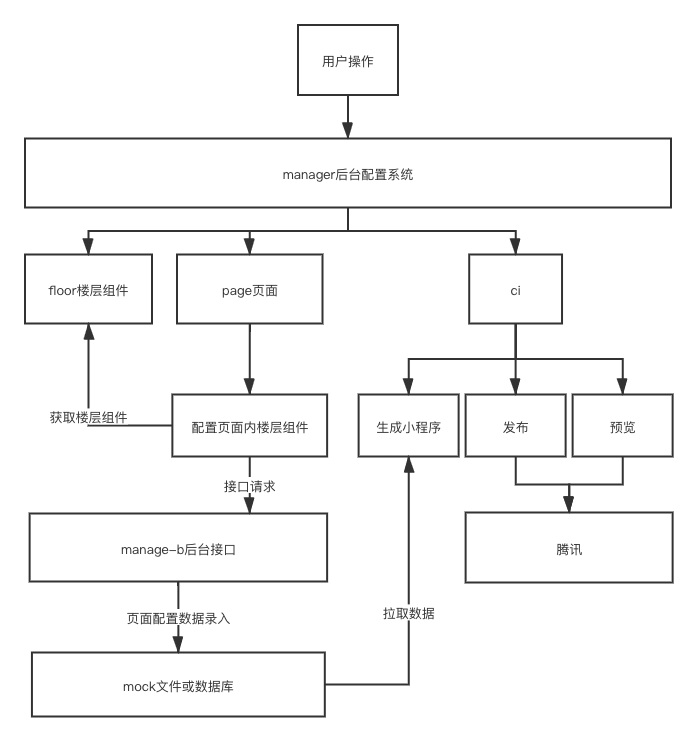

# 小程序生成器 - 主要功能

# mp-generator

##### 一个小程序生成器，根据后台管理系统的配置参数，生成相应的小程序。

* ci
  * src -- 小程序生成器、一健CI、生成预览（demo代码，仅生成器可用）
  * ci 下 执行  yarn 或 npm i进行依赖安装
*  manage-b
	*  express后台，用于提供小程序及后台管理系统依赖接口
	*  manage-b  下 执行  yarn 或 npm i进行依赖安装
	*  npm start 运行项目，保证为http://localhost:3000
*  manager
	*  后台管理系统，录入小程序生成所需要的数据
	*   manage  下 执行  yarn 或 npm i进行依赖安装
	*   npm run serve 
*  mock
	*  小程序生成所需要的mock数据配置文件
*  mp-temp
	*  小程序模板
	*  pages下为自动生成页面，仅需编写components下的组件就可以（或非pages文件外的函数）。
	  

